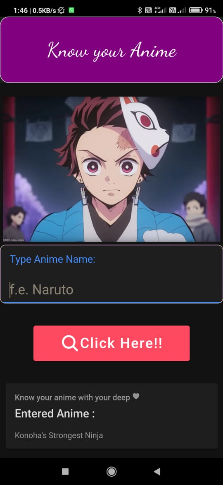

# Know Your Anime

Know your anime is a simple app where in the input field you pass on the name of your favorite character and in the app the outputs shows a small description about that character.

## Demo
<p align="center">
  
</p>
## Usage

```
1) Do git clone the repo.
2) # To install all packages and dependencies
   npm install
3) # Running app in local server
   ionic serve
4) # Build
   ionic build
5) # If you made any changes in files then do not forget to run this cmd
   ionic cap sync
6) # To open app in android Studio
   ionic cap open android

```

## Contributing
Pull requests are welcome. For major changes, please open an issue first to discuss what you would like to change.

Please make sure to update tests as appropriate.

## License
OpenSource
